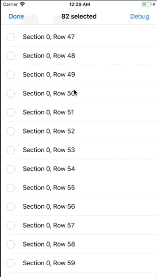
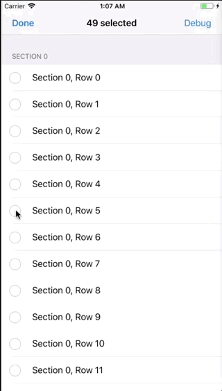
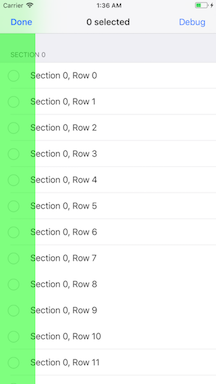

# TableViewScrollAndSelect

Elegant multi-selection for `UITableView`

[](https://cocoapods.org/pods/TableViewScrollAndSelect)
[](https://cocoapods.org/pods/TableViewScrollAndSelect)
[](https://cocoapods.org/pods/TableViewScrollAndSelect)

## Contents
1. [Overview](#overview)
2. [Example](#example)
3. [Installation](#installation)
4. [Setup](#setup)
5. [How It Works](#how-it-works)
6. [Customization](#customization)
7. [Debug Mode](#debug-mode)
8. [Troubleshooting](#troubleshooting)
9. [Current Limitations](#current-limitations)

## Overview
TableViewScrollAndSelect is a CocoaPod for iOS that provides a simple, elegant solution to  multiple row selection in a `UITableView`. It was designed to deliver an excellent user experience while requiring very little setup - nothing more than a few lines of code in your `UITableViewController`.

#### Sample Use Case
*Let's say you have a user who has 100 rows in a table view. This user decides it's time to clear up some space by deleting the last 50 rows. This, of course, means he first needs to select them. With an out-of-the-box `UITableViewController`, it would take your user 50 taps plus some scrolling to select all these rows.  With TableViewScrollAndSelect, he can select all 50 rows in one simple pan gesture.*

Selecting 50 Rows          |  More Selecting & Deselecting Rows
:-------------------------:|:-------------------------:
  |  

## Example

To run the example project, clone the repo, and run `pod install` from the Example directory first.


## Installation

TableViewScrollAndSelect is available through [CocoaPods](https://cocoapods.org). To install
it, simply add the following line to your Podfile:

```ruby
pod 'TableViewScrollAndSelect'
```

## Setup

Once you've installed the CocoaPod, you need to make a couple of modifications to your `UITableViewController`.
1. Import `TableViewScrollAndSelect`.
2. Instantiate and retain a reference to the `TableViewScrollAndSelectController` object. This is the object that does all the work for you.
3. Enable and disable your `TableViewScrollAndSelectController` when the table view begins and ends editing.
4. Configure estimated row heights for your table view.
5. Invalidate the object at deinintilization.

```swift
// 1. Import
import TableViewScrollAndSelect

class MyTableViewController: UITableViewController {

    // 2a. Retain reference to TableViewScrollAndSelectController object
    let scrollAndSelectController: TableViewScrollAndSelectController!

    // 2b. Instantiate the TableViewScrollAndSelectController object
    override func viewDidLoad() {
        super.viewDidLoad()
        scrollAndSelectController = TableViewScrollAndSelectController(tableView: tableView)
    }

    /* 3. It's recommended that you enable when the table view begins editing
          and disable when the table view ends editing */
    override func setEditing(_ editing: Bool, animated: Bool) {
        super.setEditing(editing, animated: animated)
        scrollAndSelectController.enabled = editing
    }

    // 4. Return an estimated row height
    override func tableView(_ tableView: UITableView, estimatedHeightForRowAt indexPath: IndexPath) -> CGFloat {
        return myEstimatedRowHeight
    }

    // 5. Invalidate to release memory
    deinit {
        scrollAndSelectController?.invalidate()
        scrollAndSelectController = nil
    }

}
```

*NOTE: TableViewScrollAndSelect uses the estimated row height to fine tune its scrolling animations while using as little CPU as possible. You can, however, tell it to use the actual row heights, like so...*

```swift
scrollAndSelectController.shouldUseEstimatedRowHeightWhenScrolling = false
```

## Important!

There are two critical things to keep in mind when using TableViewScrollAndSelect:

1. **`TableViewScrollAndSelectController` does not replace `UITableViewController` or create a `UITableView` for you.** You must instantiate a `TableViewScrollAndSelectController` from your `UITableViewController`, passing in your `UITableView` as a parameter, to which it will hold a weak reference.

2. **Your `UITableView` *must* have a superview.** This is due to the fact that a transparent view is added over the top of your table view to handle the pan gestures. There are 2 main ways you can accomplishing this:
    1. Put your `UITableViewController` inside a `UINavigationController` (recommended).
    2. Manually create your table view controller using a generic `UIViewController`.
        * Instantiate and add your `UITableView` as a subview.
        * Set your controller up to be the `UITableViewDelegate` and `UITableViewDataSource` of the `UITableView`.
        * You should be able to find more examples of this technique on [StackOverflow](https://stackoverflow.com).

## How it Works

If you've read this far, you already know enough to start using TableViewScrollAndSelect. This next section is for those who want a closer look at what's going on behind the scenes. You can also refer to the *Quick Help* window in XCode.

#### The Touch view
When you create a `TableViewScrollAndSelectController` object, it adds an invisible `UIView` as the topmost view over your `UITableView`. This touch view and your `UITableView` share the same superview. The touch view receives pan and tap gestures from the user, interprets them, and updates the selection and scrolling of your `UITableView` accordingly. In the picture below, the touch view has been colored green so you can see how it lays out in the view. *NOTE: The touch view uses auto layout.*



#### Tapping
A `UITapGestureRecognizer` is added to the touch view so that tapping on a cell still selects or deselects that cell as it normally would.

#### Panning
A `UIPanGestureRecognizer` is added to the touch view which handles all the multi-selection and auto-scrolling. Panning vertically will select or deselect multiple cells.

##### Selecting or deselecting
During a pan gesture, the first cell encountered determines if we are selecting or deslecting cells. For example, if the first cell in the pan was currently deselected, the `TableViewScrollAndSelectController` will select this and all other cells reached during this pan gesture.

##### Changing direction
If the pan changes direction, the `TableViewScrollAndSelectController` will switch from selecting to deselecting, or vice versa.

##### Automatic scrolling
If a pan reaches the top or bottom edge of the `UITableView`, the `TableViewScrollAndSelectController` will automatically begin scrolling the table view and will continue selecting / deselecting until the user lifts their finger, pans in the other direction, or reaches the end of the table view.

## Customization

Below is a complete list of all the fields that are currently customizable. For more details, you can also refer to the *Quick Help* window in XCode.

* `scrollingSpeed`: The speed at which the `UITableView` will scroll when a pan gesture reaches the top or bottom edge.
    * `fast`: 40 rows per second
    * `moderate`: 20 rows per second 
    * `slow`: 10 rows per second
    * `custom`: x rows per second

* `touchViewWidth`: The width in pixels of the touch view that handles pan gestures.

* `touchViewRespectsSafeArea`: Determines whether the top, left, and bottom edges of the touch view respect safe area margins.

* `topScrollingAnchor`: The point on the y-axis at which a pan gesture should begin scrolling the table view upwards.

* `bottomScrollingAnchor`: The point on the y-axis, offset from the bottom of the superview, at which a pan gesture should begin scrolling the table view downwards. *NOTE: Value must be <= 0 or no scrolling will occur.*

* `shouldUseEstimatedRowHeightWhenScrolling`: A Boolean value indicating whether to use the estimated row height or actual row height of your table view rows in order to fine tune scrolling.

* `customConstraintClosure`: A closure returning a custom set of constraints to use instead of the defaults.

## Debug Mode

Use the `setDebugMode(on:color:)` function to turn *Debug Mode* on/off. When debug mode is on, it will color the touch view green (or a custom color that you provide) and also print out logs during pan gestures.

## Troubleshooting

Below are some common issues you may run into. For other problems and concerns, please create an issue in Github.

#### The TableViewScrollAndSelectController is instantiated but nothing is happening

`TableViewScrollAndSelectController` is disabled by default. Make sure that you set `enabled = true`. It is recommended that you do so when the table view begins editing.

If you still have problems, make sure that your view hierarchy is set up in such a way that your `UITableView` has a superview. By default, a `UITableView` is the main view of its `UITableViewController`, and therefore has no superview. In order to give it a superview, you either need to put it inside a `UINavigationController`, or create your own table view controller from a generic `UIViewController`.

#### UITableViewCells can't be selected

In order for a cell to be selectable while editing, you must return `true` from the `tableView(_:canEditRowAt:)` function in your `UITableViewDataSource`. Also make sure that your `UITableView.allowsMultipleSelection` property is set to `true`.

#### Scrolling doesn't look quite right
`TableViewScrollAndSelect` uses the table view's estimated row height to fine tune the scrolling animations. Using the estimated row height typically minimizes CPU usage, making scrolling more smooth. Unfortunately, if your estimated row heights are not accurate, it may cause some unwanted side effects. These are the most common issues you may experience:
* The pan gesture does not reach the exact top or bottom of the table view.
* When the user lifts their finger, the table view scrolls and selects a few extra cells before stopping.
* While scrolling, cells are not being selected / deselected as soon as they come onto screen. This lag becomes more pronounced the longer the scroll animation lasts.

To avoid these issues, make sure to provide an accurate estimated row height in the `tableView(_:estimatedHeightForRowAt:)` function of your `UITableViewDelegate`. Alternatively, you can set `shouldUseEstimatedRowHeightWhenScrolling = false`, but be aware that this may cause lag while scrolling.

#### The TableView won't scroll at all
First, make sure that scrolling is enabled for your `UITableView` by setting `tableView.isScrolling = true`.

If you still aren't getting it to scroll, check to make sure that you haven't overriden `topScrollingAnchor` or `bottomScrollingAnchor` with anything that will prevent scrolling. The top anchor should be `>= 0` and the bottom anchor should be `<= 0`.

## Current Limitations

* Though a great deal of testing and debugging took place during development, there are currently no actual tests written for the CocoaPod. 

* As mentioned earlier, your `UITableView` must have a superview. This can be tedious to set up properly if you are not using a `UINavigationController`.

## Author

Created by [Will Loderhose](https://github.com/wloderhose).

## License

TableViewScrollAndSelect is available under the MIT license. See the LICENSE file for more info.

